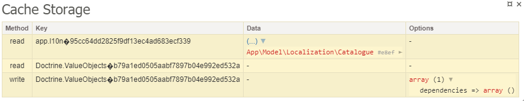

<p align=center>
  <a href="https://github.com/contributte/cache/actions"></a>
  <a href="https://coveralls.io/r/contributte/cache"></a>
  <a href="https://packagist.org/packages/contributte/cache"></a>
  <a href="https://packagist.org/packages/contributte/cache"></a>
</p>
<p align=center>
  <a href="https://packagist.org/packages/contributte/cache"></a>
  <a href="https://github.com/contributte/cache"></a>
  <a href="https://bit.ly/ctteg"></a>
  <a href="https://bit.ly/cttfo"></a>
  <a href="https://contributte.org/partners.html"></a>
</p>

<p align=center>
Website 🚀 <a href="https://contributte.org">contributte.org</a> | Contact 👨🏻‍💻 <a href="https://f3l1x.io">f3l1x.io</a> | Twitter 🐦 <a href="https://twitter.com/contributte">@contributte</a>
</p>

Small helpers and extensions for using Nette Cache in Contributte applications, including cache factory wiring, storage adapters, and Tracy debug tooling.

## Versions

| State  | Version | Branch   | Nette | PHP     |
|--------|---------|----------|-------|---------|
| dev    | `^0.8`  | `master` | 3.2+  | `>=8.2` |
| stable | `^0.7`  | `master` | 3.0+  | `>=7.2` |

## Installation

To install latest version of `contributte/cache` use [Composer](https://getcomposer.org).

```bash
composer require contributte/cache
```

## Cache Factory

Don't waste time by passing `Nette\Caching\IStorage` directly to your classes. Use our tuned `CacheFactory`.

```neon
extensions:
	cache.factory: Contributte\Cache\DI\CacheFactoryExtension
```

By default `Nette\Caching\Cache` is provided when `$cacheFactory->create()` is called. You can change it to your implementation.

```neon
services:
	cache.factory.factory: App\Model\MyCacheFactory
```

## Storages

MemoryAdapterStorage is optimized for reading the same key multiple times during one application run.

```php
use Contributte\Cache\Storages\MemoryAdapterStorage;
use Nette\Caching\Storages\FileStorage;
use Nette\Caching\Storages\SQLiteJournal;

$storage = new MemoryAdapterStorage(
	new FileStorage($path, new SQLiteJournal($path))
);
```

## Debug Panel

Show all calls to storage in Tracy panel.

```neon
extensions:
	cache.debug: Contributte\Cache\DI\DebugStorageExtension

cache.debug:
	debug: %debugMode%
```



## Development

See [how to contribute](https://contributte.org) to this package.
This package is currently maintained by these authors.

<a href="https://github.com/f3l1x">
    
</a>

-----

Consider to [support](https://contributte.org/partners) **contributte** development team.
Also thank you for using this package.
